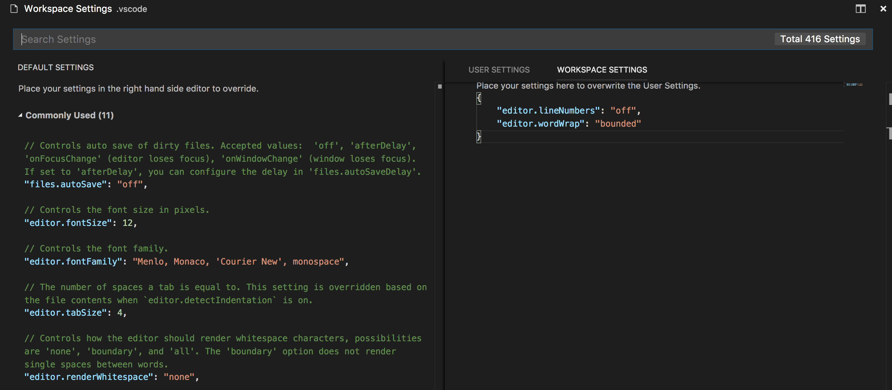
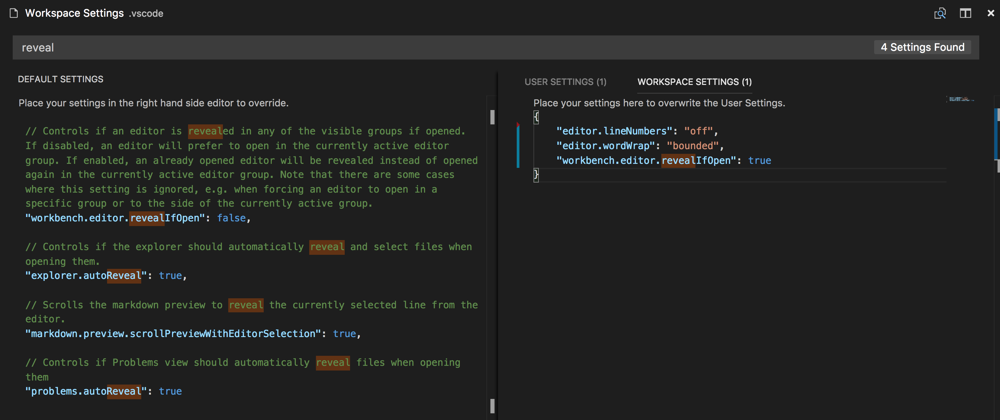
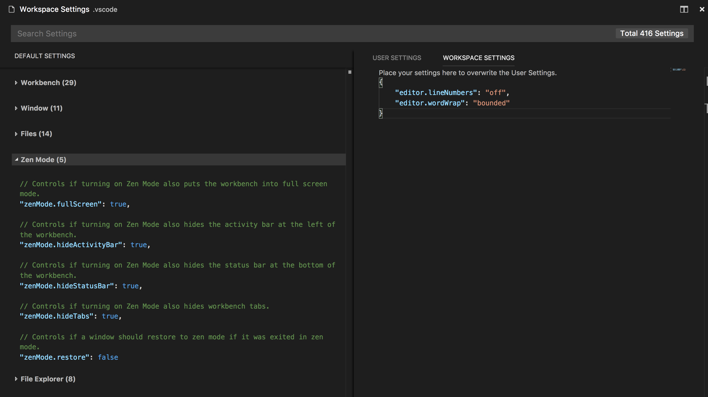
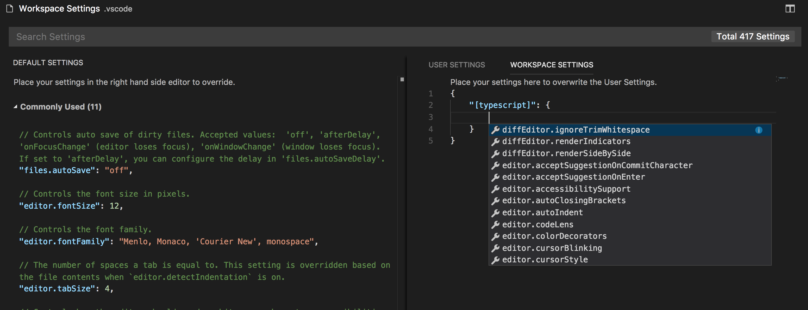

さまざまな設定をによって Visual Studio Code を構成することは簡単です。VS Code のエディター、ユーザー インターフェイス、機能の動作のほぼすべてに、変更可能なオプションが用意されています。

VS Code は設定用に 2 つのスコープを提供します:

* **User** - この設定は VS Code に登録され、開いたすべての場所でグローバルに適応されます。
* **Workspace** - この設定はワークスペース内に保存され、そのワークスペースを開いたときのみに適応されます。この設定はユーザー設定よりも優先されます。

## ユーザー、ワークスペースの設定を作成

ユーザー、ワークスペースの設定を開くには、次のメニュー コマンドを使用します:

* Windows/Linux - **File** > **Preferences** > **Settings**
* macOS - **Code** > **Preferences** > **Settings**

デフォルトの設定リストが提供されるので、これから編集したい設定をコピーして `settings.json` に書き込みます。検索ボックス下のタブを使用すると、ユーザーとワークスペースの設定を素早く切り替えることが可能です。

また **コマンドパレット** (`kb(workbench.action.showCommands)`) から**Preferences: Open User Settings** や **Preferences: Open Workspace Settings** を実行したり、キーボード ショートカット (`kb(workbench.action.openGlobalSettings)`) を使用することでも、ユーザー、ワークスペースの設定を開くことが可能です。

次の例は、エディターの行番号を無効にし、エディターのサイズに基づいて自動的に折り返すように行折り返し設定を構成します:



設定の変更は編集した `settings.json` を保存することで適用されます。

>**Note:** ワークスペースの設定は、チーム全体でプロジェクト設定を共有するのに便利です。

## 設定ファイルの場所  <a id="settings-file-locations"></a>

プラットホーム別ユーザー設定ファイルは次の場所にあります:

* **Windows** `%APPDATA%\Code\User\settings.json`
* **Mac** `$HOME/Library/Application Support/Code/User/settings.json`
* **Linux** `$HOME/.config/Code/User/settings.json`

なおワークスペースの設定ファイルはルート フォルダーの `.vscode` フォルダーの下にあります。

>**Note:** [Multi-root Workspace](/docs/userguide/multi-root-workspaces.md#settings) を使用しているとき、ワークスペースの設定はワークスペース 構成ファイル内にあります。

## 設定エディター

設定エディターを開くと、探している設定を検索して見つけることができる **Default Settings** を確認できます。検索バーを使用して検索すると、条件に一致する設定を表示および強調表示します。それだけでなく一致しない検索結果も除外します。これにより、設定をすばやく簡単に見つけることが可能です。また **既定の設定**と `settings.json` エディターで設定をコピーまたは更新に役立つ操作を用意されています。



**Note**: VS Code 拡張機能もまた独自の設定を追加することができ、これは **Default Settings** に表示されます。

### 設定グループ  <a id="settings-groups"></a>

簡単に設定に辿り着けるように、既定の設定を種類ごとに分類しています。上部には人気のカスタマイズを示す **Most Commonly Used** グループが用意されています。




## 言語固有のエディター設定

言語設定を設定するには **コマンドパレット** (`kb(workbench.action.showCommands)`) から **Preferences: Configure language specific settings...** (command id: `workbench.action.configureLanguageBasedSettings`) を実行します。言語を選択すると、言語エントリーを設定エディターに追記します。




もし既に開いているファイルのファイル タイプをカスタマイズする場合、VS Code ステータスバー右の言語モードをクリックしてください。これにより、**言語モードの選択**が開きます。この中の言語から選択することで、言語エントリーを追記した設定エディターが開かれます。

もちろん直接 `settings.json` を開くことによっても言語ベースの設定は可能です。他の設定と同じようにワークスペース設定にその設定を配置すれば、スコープを指定することができます。なおユーザーとワークスペースの両方で言語設定を定義している場合は、ワークスペースの設定が優先されます。

次の例は、言語モード `typescript` と ` markdown` のエディター設定をカスタマイズします。

```json
{
  "[typescript]": {
    "editor.formatOnSave": true,
    "editor.formatOnPaste": true
  },
  "[markdown]": {
    "editor.formatOnSave": true,
    "editor.wordWrap": "on",
    "editor.renderWhitespace": "all",
    "editor.acceptSuggestionOnEnter": "off"
  }
}
```

許可された言語ベースの設定を見つけるときは設定エディター内で IntelliSense を使用すると役立ちます。すべてのエディター設定と非エディター設定をがサポートされます。

## 設定とセキュリティー  <a id="settings-and-security"></a>

設定では VS Code の動作に使ういくつかの実行可能ファイルを指定できます。たとえば、統合ターミアンルが使用するシェルを選択できます。セキュリティーを強化するために、このような設定はワークスペース スコープではなくユーザー設定のみで定義することが可能です。

ワークスペースでの設定をサポートしていないものは次の通りです:

- `git.path`
- `terminal.integrated.shell.linux`
- `terminal.integrated.shellArgs.linux`
- `terminal.integrated.shell.osx`
- `terminal.integrated.shellArgs.osx`
- `terminal.integrated.shell.windows`
- `terminal.integrated.shellArgs.windows`
- `terminal.external.windowsExec`
- `terminal.external.osxExec`
- `terminal.external.linuxExec`

これら設定のいずれかを設定したワークスペースを開くと、VS Code は警告し、その後は常にその値を無視します。

## デフォルト設定


```json
省略
```

## よくある質問

**Q: 「設定を書き込めません」と表示されます**

**A:** 設定を使用とするとき (たとえば、自動保存を有効にする、新しいテーマの選択など)に、 "Unable to write settings. Please open User Settings to correct errors/warnings in the file and try again." というエラーが出るかもしれません。これは`settings.json`が文法的に正しくないかエラーがあることを意味します。このエラーとはカンマや設定値が抜けているなど単純なものになります。**ファイル** > **基本設定** > **設定**を開いて、赤の波線で強調表示されるエラーを確認してください。

**Q: ワークスペース設定はいつ利用すべきですか？**

**A:** カスタム設定が必要なワークスペースを使用していて、他のプロジェクトに適用したくない場合です。よくある例としては言語固有の lint ルールです。
